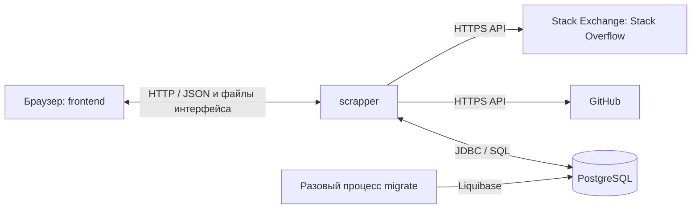

# Simplified Link Tracker

Simplified Link Tracker — веб-приложение для хранения ссылок и отслеживания активности
в репозиториях GitHub и вопросах Stack Overflow. Пользователь собирает интересующие
ресурсы в одном месте и видит обнаруженные изменения в общей ленте.

В интерфейсе можно:

- добавлять ссылку с названием и тегами;
- просматривать коллекцию, искать по названию или URL и фильтровать по тегу;
- редактировать адрес, название и теги;
- приостанавливать и возобновлять автоматическое отслеживание;
- запускать проверку выбранного ресурса вручную;
- просматривать последние обновления и ошибки проверок;
- удалять ссылку вместе с её историей.

Коллекция общая для всех посетителей, учётных записей и авторизации нет. Все сохранённые
ссылки и результаты мониторинга хранятся в PostgreSQL. Инструкция по запуску находится
ниже, описание предметной области и разбор 12 факторов — в [отчёте](Отчёт.md).
Исходники и история версий: [Sushcheva/simplified-link-tracker](https://github.com/Sushcheva/simplified-link-tracker).
Для локального Kubernetes в Docker Desktop есть [пошаговый гайд](docs/Kubernetes.md).

## Структура

```text
simplified-link-tracker/
├── frontend/                 # Maven-модуль браузерного интерфейса
│   └── src/main/resources/META-INF/resources/
│       ├── index.html        # разметка страницы и форм
│       ├── styles.css        # оформление и адаптация к размеру экрана
│       └── app.js            # запросы к API и обновление интерфейса
├── scrapper/                 # Maven-модуль серверного приложения
│   └── src/main/
│       ├── java/backend/academy/linktracker/scrapper/
│       │   ├── controller/   # HTTP-маршруты
│       │   ├── service/      # правила работы со ссылками и мониторингом
│       │   ├── repository/   # SQL-запросы к PostgreSQL
│       │   ├── client/       # HTTP-клиенты GitHub и Stack Exchange
│       │   ├── scheduler/    # периодический запуск проверок
│       │   │   └── checker/  # проверка каждого типа ресурса
│       │   ├── domain/       # модели ссылки и обновления
│       │   ├── dto/          # формат входных данных и страницы результатов
│       │   ├── exception/    # формирование ответов об ошибках
│       │   └── properties/   # настройки мониторинга и внешних API
│       └── resources/
│           ├── application.yaml
│           └── migrations/   # схема БД и миграции Liquibase
├── scripts/                  # проверки, упаковка исходников и подготовка Kubernetes-релиза
├── k8s/                      # PostgreSQL, web, worker, миграция и конфигурация Kubernetes
├── docs/Kubernetes.md        # запуск, проверка, обновление и остановка в Docker Desktop
├── Dockerfile                # сборка и среда выполнения приложения
├── compose.yaml              # приложение, PostgreSQL и разовая миграция
├── .env.example              # образец настроек локального запуска
├── pom.xml                   # общая сборка двух модулей
└── Отчёт.md                  # отчёт по домашнему заданию
```

Проект состоит из двух Maven-модулей: `frontend` и `scrapper`. Модуль — это часть
исходного кода с собственным `pom.xml`; отдельный модуль не обязательно означает
отдельный сервер или контейнер. Корневой `pom.xml` объединяет их в одну сборку.

## Компоненты и их взаимодействие

**`frontend` — интерфейс пользователя.** HTML задаёт содержимое страницы, CSS отвечает
за оформление, JavaScript обрабатывает действия пользователя и отправляет HTTP-запросы
к `/api/links` и `/api/updates`. Данные передаются в JSON. Интерфейс показывает коллекцию,
формы редактирования, состояние проверок и ленту обновлений. JavaScript выполняется
в браузере; отдельная установка Node.js для сборки или запуска не требуется.

**`scrapper` — серверная часть.** Приложение на Java 25 и Spring Boot 4.0.2 принимает
запросы интерфейса, проверяет входные данные, выполняет CRUD и обращается к внешним API.
CRUD — создание, чтение, изменение и удаление записей. Внутри модуля обязанности разделены:

| Часть модуля | Назначение |
|---|---|
| `ScrapperController` | Принимает HTTP-запросы и передаёт работу сервисам |
| `LinkService`, `LinkUrlNormalizer` | Управляют ссылками, приводят URL и теги к принятому формату |
| `JdbcLinkRepository` | Читает и изменяет данные в PostgreSQL через параметризованные SQL-запросы |
| `LinkUpdaterScheduler` | По расписанию запускает проверки ссылок, для которых наступил срок |
| `LinkMonitorService` | Координирует проверку, сравнивает временные отметки и сохраняет результат |
| `GitHubUpdateChecker`, `StackOverflowUpdateChecker` | Извлекают сведения об изменении соответствующего ресурса |
| `GitHubClient`, `StackOverflowClient` | Отправляют HTTP-запросы к GitHub API и Stack Exchange API |

**PostgreSQL — постоянное хранилище.** Таблица `links` содержит ссылки, теги и состояние
мониторинга; `link_updates` — обнаруженные изменения. Теги хранятся массивом JSONB внутри
ссылки. Схему создаёт Liquibase по файлам из `scrapper/src/main/resources/migrations`.

**`migrate` — разовый процесс подготовки БД.** Он запускается из того же JAR или образа,
что и сервер, применяет миграции и завершается. Это режим запуска `scrapper`, а не
дополнительный Maven-модуль. В Compose приложение запускается после успешной миграции.

**`scripts` — вспомогательные команды.** `check_api.py` проверяет HTTP API,
`api_fixture.py` предоставляет тестовые ответы внешних сервисов, `verify-local.sh`
поднимает изолированное окружение проверки, `package_source.py` создаёт архив исходников.
Эти скрипты не участвуют в обычной работе приложения.

При сборке ресурсы `frontend` упаковываются в библиотеку, которую `scrapper` включает
в исполняемый JAR. Сервер раздаёт HTML, CSS, JavaScript и API через один порт. При обычном
запуске через Compose постоянно работают два сервиса: `app` и `postgresql`.



Например, при добавлении ссылки браузер отправляет `POST /api/links`. Контроллер
принимает запрос, сервис проверяет и нормализует адрес, репозиторий сохраняет запись
в PostgreSQL. Сервер возвращает созданную ссылку, и браузер показывает её в коллекции.
Фоновый мониторинг затем получает временную отметку ресурса через внешний API;
обнаруженное изменение сохраняется в БД и появляется в ленте при её обновлении.

## Запуск через Docker

Нужны запущенный Docker и Docker Compose v2. Java и Maven на хосте не нужны.

1. В каталоге проекта скопируйте пример настроек:

   ```bash
   cp .env.example .env
   ```

2. Замените `DATABASE_PASSWORD` в `.env` своим паролем. При необходимости измените
   `APP_PORT`. Для проверки большого числа репозиториев можно добавить `GITHUB_TOKEN`
   или увеличить `SCHEDULER_INTERVAL`: внешние API ограничивают частоту запросов.

3. Соберите приложение, затем запустите готовый образ:

   ```bash
   docker compose build app
   docker compose up -d
   ```

4. Откройте [http://localhost:8080](http://localhost:8080).

Compose сначала ждёт готовности PostgreSQL, затем применяет миграции и только после
их успешного завершения запускает приложение. Данные PostgreSQL находятся в named
volume. Обычный `docker compose down` их сохраняет.

```bash
docker compose logs -f app
docker compose ps -a
docker compose down
```

`docker compose down -v` удаляет базу: используйте эту команду только для намеренного
сброса данных. Порт приложения опубликован на `127.0.0.1`; база наружу не опубликована.
Приложение предназначено для учебного локального запуска: авторизации нет, коллекция общая.

## Запуск в Kubernetes

[Гайд для Docker Desktop](docs/Kubernetes.md) описывает включение кластера, сборку образа,
создание Secret и постоянного хранилища PostgreSQL, миграцию отдельным Job и запуск
двух web-экземпляров с отдельным worker. В нём также есть команды проверки,
масштабирования, обновления и возврата к предыдущему релизу.

Шаблоны находятся в `k8s/`. Скрипт `scripts/render_k8s.py` подставляет идентификатор
релиза и образ, сохраняя результат в `.local/k8s/<релиз>`.
Применять шаблоны напрямую не нужно: порядок команд приведён в гайде.
Kubernetes-сценарий подготовлен, но его запуск в кластере пока не подтверждён.

## Сборка и запуск без Docker

Нужны JDK 25 и PostgreSQL. Maven скачивается Wrapper-скриптом. Сборка и unit-тесты:

```bash
./mvnw --batch-mode --no-transfer-progress clean package
```

Создайте пустую БД `linktracker` и пользователя с правами на её схему. Затем задайте
переменные окружения. При таком запуске Java **не читает `.env` автоматически**.

```bash
export DATABASE_URL=jdbc:postgresql://localhost:5432/linktracker
export DATABASE_USER=linktracker
export DATABASE_PASSWORD='your-local-password'
```

Примените миграции отдельной командой:

```bash
APP_MODE=migrate MIGRATIONS_ENABLED=true SCHEDULER_ENABLED=false \
  SPRING_MAIN_WEB_APPLICATION_TYPE=none \
  java -jar scrapper/target/scrapper.jar
```

Запустите уже собранный JAR:

```bash
java -jar scrapper/target/scrapper.jar
```

Миграции при обычном запуске отключены. Если схема ещё не создана, сначала выполните
команду миграции. В IntelliJ IDEA открывайте корневой `pom.xml`; для удобного запуска
с интерфейсом используйте собранный JAR, в который уже включён модуль `frontend`.

## Настройки

| Переменная | Значение по умолчанию / назначение |
|---|---|
| `DATABASE_URL` | `jdbc:postgresql://localhost:5432/linktracker` |
| `DATABASE_USER` | `linktracker` |
| `DATABASE_PASSWORD` | Обязательна, значения в исходниках нет |
| `DATABASE_NAME` | `linktracker`; имя БД в Compose |
| `PORT` | `8080`; порт Java-процесса |
| `APP_PORT` | `8080`; публикуемый порт Compose |
| `DB_POOL_SIZE` | `5` |
| `MIGRATIONS_ENABLED` | `false`; включается для разовой миграции |
| `APP_MODE` | `web`; `migrate` завершает процесс после инициализации. Для миграции нужны также `MIGRATIONS_ENABLED=true`, отключённые планировщик и веб-сервер |
| `SPRING_MAIN_WEB_APPLICATION_TYPE` | Определяется Spring Boot; `none` отключает HTTP-сервер |
| `SCHEDULER_ENABLED` | `true`; включает фоновую проверку |
| `SCHEDULER_INTERVAL` | `60s`; пауза между проходами и минимальная пауза между проверками ссылки |
| `SCHEDULER_BATCH_SIZE` | `20`; число ссылок за проход, от 1 до 100 |
| `GITHUB_API_URL` | `https://api.github.com` |
| `STACKOVERFLOW_API_URL` | `https://api.stackexchange.com/2.3` |
| `GITHUB_TOKEN` | Необязательный токен GitHub |
| `API_CONNECT_TIMEOUT` / `API_READ_TIMEOUT` | `2s` / `5s` |
| `LOG_LEVEL` | `INFO` |
| `RELEASE_VERSION` | `1.0.0`; тег локального Docker-образа |

При запуске JAR переменные напрямую получает Java. Compose передаёт основные
переменные из `compose.yaml`; для переопределения дополнительных свойств добавьте их
в `environment` сервиса или используйте Compose override.

## REST API

Все адреса находятся под `/api`. Ошибки возвращаются в формате Problem Details с
полем `detail`; интерфейс показывает его пользователю.

| Метод | Адрес | Действие |
|---|---|---|
| GET | `/api/links?search=&tag=&page=0&size=20` | Список и точный фильтр по тегу, страницы от 0 |
| GET | `/api/links/{id}` | Одна ссылка |
| POST | `/api/links` | Создание, ответ 201 с заголовком Location |
| PUT | `/api/links/{id}` | Изменение URL, названия, тегов и enabled |
| DELETE | `/api/links/{id}` | Удаление ссылки и её истории, ответ 204 |
| POST | `/api/links/{id}/check` | Проверка выбранной ссылки сейчас |
| GET | `/api/updates?linkId=...` | Последние 20 событий, необязательный фильтр по ссылке |
| GET | `/actuator/health` | Состояние приложения и БД |
| GET | `/actuator/health/readiness` | Готовность принимать запросы с учётом БД |

Пример тела POST/PUT:

```json
{
  "url": "https://github.com/spring-projects/spring-boot",
  "title": "Spring Boot",
  "tags": ["java", "backend"],
  "enabled": true
}
```

```bash
curl -i http://localhost:8080/api/links \
  -H 'Content-Type: application/json' \
  -d '{"url":"https://github.com/spring-projects/spring-boot","title":"Spring Boot","tags":["java"],"enabled":true}'
```

Название обязательно (до 120 символов), до 10 тегов по 32 символа. Поддерживаются
HTTPS-ссылки вида `github.com/owner/repository` и `stackoverflow.com/questions/id`.
Эквивалентные адреса нормализуются; повтор возвращает 409. Отсутствующий ID — 404,
неверный ввод — 400. При редактировании занятой проверкой ссылки возвращается 409.

## Как работает мониторинг

1. Новая ссылка сохраняется независимо от доступности внешних API.
2. Первая успешная проверка запоминает временную отметку ресурса без уведомления о
   старых изменениях. Можно нажать «Проверить сейчас», не ожидая планировщика.
3. При увеличении `updated_at` GitHub или `last_activity_date` Stack Overflow запись
   добавляется в `link_updates`. Проверяется активность ресурса, а не каждый отдельный
   коммит или ответ.
4. Событие и новая отметка сохраняются в одной транзакции. Уникальная пара
   `(link_id, remote_updated_at)` исключает повтор одного события.
5. Ошибка API сохраняется в `last_error`, последняя успешная отметка остаётся прежней.
   Следующая автоматическая попытка — не раньше чем через 5 минут.
6. При смене URL история этой записи очищается, а первая проверка нового адреса
   устанавливает новую точку отсчёта. Удаление ссылки каскадно удаляет её события.

Каждая проверка выполняется в отдельной транзакции. Запрос `FOR UPDATE SKIP LOCKED`
блокирует выбранную строку ссылки и позволяет другим процессам пропускать занятые строки.
Блокировка удерживается во время обращения к внешнему API; для подключения и чтения
ответа заданы таймауты. Общего ограничения времени всей транзакции нет. После обнаружения
разрыва соединения с завершившимся процессом PostgreSQL откатывает незавершённую
транзакцию и освобождает блокировку. Подход рассчитан на небольшую учебную коллекцию.

Фронтенд обновляет список и ленту каждые 30 секунд, когда вкладка видима и форма закрыта.
Пауза отключает автоматическую проверку конкретной ссылки; ручная проверка остаётся доступна.

## Тесты

```bash
# Unit-тесты, Docker не требуется
./mvnw test

# HTTP/CRUD, миграции и блокировки на настоящей PostgreSQL 16.4 через Testcontainers
# Требуется запущенный Docker
./mvnw -Pintegration verify

# Проверка CRUD на уже запущенном приложении; создаёт и удаляет свои тестовые ссылки
python3 scripts/check_api.py http://localhost:8080

# Изолированная проверка без Docker: нужны initdb, pg_ctl, createdb, Python 3, JDK 25
# Сначала соберите JAR. Используется временная БД и локальные заглушки внешних API.
bash scripts/verify-local.sh
```

Версию PostgreSQL в последней команде определяют установленные на компьютере бинарники.
Интеграционные тесты с Testcontainers используют ту же версию, что и Compose.
Результаты фактически выполненных проверок приведены в `Отчёт.md`.

## Запуск нескольких процессов

Один JAR можно запускать в нескольких экземплярах с разными `PORT` и общей БД.
HTTP-обработчики не сохраняют пользовательские данные в памяти, локального кэша нет.
Проверки координируются через БД. Для отдельного фонового процесса:

```bash
# HTTP-процесс
SCHEDULER_ENABLED=false PORT=8080 java -jar scrapper/target/scrapper.jar

# Фоновый процесс (worker) без веб-сервера
APP_MODE=worker SPRING_MAIN_WEB_APPLICATION_TYPE=none SCHEDULER_ENABLED=true \
  java -jar scrapper/target/scrapper.jar
```

Значение `APP_MODE=worker` обозначает назначение процесса. Сам HTTP-сервер отключает
`SPRING_MAIN_WEB_APPLICATION_TYPE=none`, а проверки включает `SCHEDULER_ENABLED=true`.
Обоим процессам нужны переменные подключения к одной PostgreSQL и готовая схема БД.

При масштабировании через Compose потребуется настроить разные опубликованные порты
или балансировщик: текущий файл рассчитан на один локальный HTTP-экземпляр.

## Исходники для сдачи

```bash
python3 scripts/package_source.py
```

Архив появится по пути `dist/simplified-link-tracker-1.0.0.zip`. В него входят исходники,
Maven Wrapper, конфигурация и `Отчёт.md`; `.env`, `.git`, каталоги сборки, IDE и результаты тестов исключены.
Проект ведётся в одном Git-репозитории, связанном через `origin` с GitHub.
Коммит сдаваемой версии можно получить командой `git rev-parse HEAD`.
Локальные секреты и каталог `.local/` в исходный архив не включаются.
Для нового релиза задавайте новый `RELEASE_VERSION` и сохраняйте образ и соответствующую
ему конфигурацию. При изменении версии приложения согласуйте её в Maven POM и имени
архива в `scripts/package_source.py`. Возврат к предыдущему образу требует совместимой
схемы БД; автоматический откат миграций не реализован.
