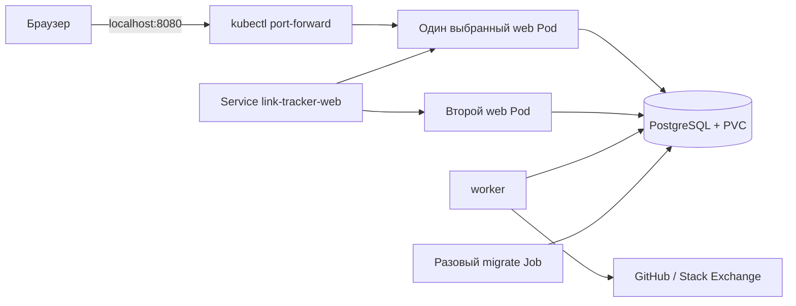

# Развёртывание Simplified Link Tracker в Kubernetes

Гайд рассчитан на локальный Kubernetes в Docker Desktop. Все команды выполняются
из корня проекта. Потребуются Docker Desktop, `kubectl`, Git и Python 3.
Java и Maven на компьютере для Docker-сборки не нужны.

Исходники: [Sushcheva/simplified-link-tracker](https://github.com/Sushcheva/simplified-link-tracker).
Kubernetes запускает контейнеры из образа приложения; репозиторий GitHub хранит код
и сам по себе не служит реестром контейнерных образов.

## Что будет работать

| Объект | Назначение |
|---|---|
| Namespace `link-tracker` | Группа ресурсов этого проекта |
| StatefulSet `postgresql`, 1 Pod | PostgreSQL 16.4 |
| PVC `data-postgresql-0`, 2 GiB | Диск базы данных, переживающий замену Pod |
| Service `postgresql` | Постоянное DNS-имя базы внутри namespace |
| ConfigMap с идентификатором релиза | Адреса API, интервалы, таймауты и другие несекретные настройки |
| Secret `link-tracker-secrets-<релиз>` | Пароль БД и необязательный токен GitHub |
| Job `link-tracker-migrate-<релиз>` | Однократное применение миграций |
| Deployment `link-tracker-web`, 2 Pod | REST API и выдача HTML/CSS/JavaScript |
| Deployment `link-tracker-worker`, 1 Pod | Фоновая проверка ссылок |
| Service `link-tracker-web` | Внутренний HTTP-адрес готовых веб-экземпляров |

Pod — запускаемая Kubernetes единица, здесь с одним контейнером.
Deployment поддерживает нужное число экземпляров приложения.
StatefulSet закрепляет идентичность экземпляра БД и связанного диска.
Job выполняет задачу до завершения. Service даёт процессам стабильный сетевой адрес.
[Deployments](https://kubernetes.io/docs/concepts/workloads/controllers/deployment/),
[StatefulSets](https://kubernetes.io/docs/concepts/workloads/controllers/statefulset/),
[Jobs](https://kubernetes.io/docs/concepts/workloads/controllers/job/).



Вход выполняется по email и паролю. Сессии хранятся в PostgreSQL и доступны всем
web Pod; sticky sessions не нужны. Этот сценарий использует ClusterIP и локальный
port-forward по HTTP, поэтому в ConfigMap задано `SESSION_COOKIE_SECURE=false`.
При публикации через HTTPS задайте `true` в новом релизе ConfigMap, настройте TLS
и ограничение частоты входа/регистрации на входном прокси. `SESSION_TIMEOUT=30m`
задаёт срок сессии без обращений к серверу.

## Dockerfile, образ и Pod

Dockerfile описывает, как собрать образ: какую Java взять, какие файлы добавить
и какую команду запускать. Kubernetes-манифесты описывают запуск готового образа:
число реплик, ресурсы, порты Service, probes, тома, ConfigMap и Secret. Kubernetes
не собирает Dockerfile; поле `image` в манифесте связывает эти два этапа.

```text
исходники + Dockerfile → образ в GHCR → Deployment → Pod → контейнер Java
```

Pod может содержать один или несколько тесно связанных контейнеров. Они размещаются
на одном узле, делят сетевое пространство и могут совместно использовать тома.
В этом проекте в каждом Pod один основной контейнер: отдельно web, worker или
PostgreSQL. Две web-реплики — два Pod с одним контейнером в каждом. Увеличение числа
контейнеров внутри одного Pod не заменяет увеличение числа реплик Deployment.
[Dockerfile](https://docs.docker.com/build/concepts/dockerfile/),
[Pod](https://kubernetes.io/docs/concepts/workloads/pods/).

## 1. Подготовить Docker Desktop

1. Запустить Docker Desktop.
2. Включить Kubernetes. В новых версиях это раздел **Kubernetes → Create cluster**;
   в старых — **Settings → Kubernetes → Enable Kubernetes**.
3. Если доступен выбор, для этого сценария выбрать **kubeadm**, один узел.
4. Дождаться готовности кластера.

Готовый релиз использует образ из GHCR по digest. Вариант с локальной сборкой
использует образ Docker Desktop и `imagePullPolicy: IfNotPresent`. Для режима kind
или отдельного удалённого кластера локальную сборку может потребоваться загрузить
в узлы либо опубликовать в реестре.
Параметры кластеров описаны в [документации Docker Desktop](https://docs.docker.com/desktop/use-desktop/kubernetes/).

Для трёх Java-процессов, БД и самого кластера разумно начать с 4 CPU и 6 GiB памяти
в настройках Docker Desktop. Это начальная оценка; фактическое потребление нужно
измерить. В манифестах заданы requests и limits для каждого контейнера.

Проверить подключение:

```bash
docker info
kubectl config get-contexts
kubectl config use-context docker-desktop
kubectl get nodes
kubectl get storageclass
kubectl version
```

Ожидается узел со статусом `Ready` и StorageClass с пометкой `(default)`.
Все дальнейшие команды относятся к контексту `docker-desktop`.
Если контекста нет, сначала нужно закончить включение Kubernetes.
Версию `kubectl` следует держать в пределах одного minor-релиза от API-сервера.
[Правила совместимости версий](https://kubernetes.io/releases/version-skew-policy/#kubectl).

## 2. Выбрать готовый релиз или подготовить локальную сборку

Для опубликованной версии скачать `deployment.zip` и `release.json` из раздела
[Releases](https://github.com/Sushcheva/simplified-link-tracker/releases).
Комплект содержит образ по digest и конфигурацию, связанную с релизом. После проверки
контрольных сумм распаковать `deployment.zip` в `.local/k8s/v1-2-0` и задать:

```bash
export RELEASE_ID=v1-2-0
export RELEASE_DIR=".local/k8s/$RELEASE_ID"
export SECRET_NAME="link-tracker-secrets-$RELEASE_ID"
```

Затем перейти к шагу 3; пересборка приложения не нужна. Pipeline выпускает образ
для `linux/amd64`. Для другого процессора потребуется подходящая сборка или
поддержка эмуляции. Механизм публикации описан в [гайде по релизам](Releases.md).

Для проверки собственных изменений на локальном стенде можно подготовить отдельный
комплект из исходников следующими командами.

Сначала убедиться, что изменения зафиксированы:

```bash
git status --short
```

Пустой вывод означает чистое рабочее дерево. Для релиза сохранить текущий коммит,
выбрать уникальное имя и собрать образ:

```bash
export RELEASE_ID="r$(date -u +%Y%m%d%H%M%S)-$(git rev-parse --short=8 HEAD)"
export APP_IMAGE="simplified-link-tracker:$RELEASE_ID"
docker build --label "org.opencontainers.image.revision=$(git rev-parse HEAD)" \
  -t "$APP_IMAGE" .
python3 scripts/render_k8s.py --release "$RELEASE_ID" --image "$APP_IMAGE"
export RELEASE_DIR=".local/k8s/$RELEASE_ID"
export SECRET_NAME="link-tracker-secrets-$RELEASE_ID"
docker image inspect "$APP_IMAGE" --format '{{.Id}}'
```

Скрипт создаёт шесть готовых манифестов (включая необязательный `assign-legacy.yaml`) и `release.json` в `$RELEASE_DIR`.
В Job, web и worker будет один образ; ConfigMap получит имя с идентификатором релиза
и `immutable: true`. Исходные шаблоны в `k8s/` остаются общими для всех релизов.

Не следует выполнять `kubectl apply -f k8s/`: часть файлов — шаблоны с подстановками,
а БД, миграции и приложение требуют последовательного запуска.
Не следует пересобирать другой код под уже использованным тегом релиза.
Каталог `.local/` исключён из Git, Docker-контекста и исходного архива.

Записать проверяемые сведения о сборке рядом с манифестами:

```bash
git rev-parse HEAD > "$RELEASE_DIR/commit.txt"
docker image inspect "$APP_IMAGE" --format '{{.Id}}' > "$RELEASE_DIR/image-id.txt"
```

При повторном открытии терминала нужно снова задать `RELEASE_ID`, `APP_IMAGE`
и `RELEASE_DIR` для уже подготовленного релиза. Повторный запуск генератора с тем же
идентификатором отклоняется, чтобы случайно не перезаписать комплект манифестов.

## 3. Создать namespace и Secret

```bash
kubectl apply -f k8s/namespace.yaml
cp k8s/secret.env.example .env.k8s
chmod 600 .env.k8s
```

Открыть `.env.k8s` и заменить `DATABASE_PASSWORD` собственным локальным паролем.
`GITHUB_TOKEN` можно оставить пустым. Файл исключён из Git и архива.

Создать Secret один раз:

```bash
kubectl -n link-tracker create secret generic "$SECRET_NAME" \
  --from-env-file=.env.k8s
kubectl -n link-tracker patch secret "$SECRET_NAME" --type merge \
  -p '{"immutable":true}'
```

Если Secret уже существует, команда завершится ошибкой `AlreadyExists`.
Новый релиз получает новое имя Secret. Для той же базы используйте согласованный
пароль из существующего окружения. Старые Secret сохраняются для совместимых откатов;
изменять значения уже использованного Secret не нужно.

Значения из Secret попадают в переменные окружения процессов.
Secret отделяет конфиденциальные настройки от исходников, но не означает
автоматического шифрования данных в хранилище кластера.
[Модель Kubernetes Secrets](https://kubernetes.io/docs/concepts/configuration/secret/).

Пароль PostgreSQL применяется при первоначальном создании её хранилища.
Редактирование Secret само по себе не меняет пароль существующего пользователя БД.
Поэтому при повторном развёртывании с тем же PVC нужно сохранять согласованный пароль.
Ротация пароля требует отдельной операции в PostgreSQL и обновления потребителей.

## 4. Запустить PostgreSQL

```bash
kubectl apply -f "$RELEASE_DIR/postgresql.yaml"
kubectl -n link-tracker rollout status statefulset/postgresql --timeout=180s
kubectl -n link-tracker get pods,pvc
```

Ожидается Pod `postgresql-0` со статусом `Running`, готовностью `1/1`
и PVC `data-postgresql-0` со статусом `Bound`.

Если PVC остаётся `Pending`, посмотреть:

```bash
kubectl -n link-tracker describe pvc data-postgresql-0
kubectl get storageclass
```

Манифест использует StorageClass по умолчанию. Для другого кластера может понадобиться
явно указать `storageClassName` в `volumeClaimTemplates`.
Одна PostgreSQL с одним PVC подходит для учебного стенда; репликация и резервное
копирование этим манифестом не настраиваются.

## 5. Выполнить миграции

```bash
kubectl apply -f "$RELEASE_DIR/configmap.yaml"
kubectl apply -f "$RELEASE_DIR/migrate.yaml"
kubectl -n link-tracker wait --for=condition=complete \
  "job/link-tracker-migrate-$RELEASE_ID" --timeout=180s
kubectl -n link-tracker logs "job/link-tracker-migrate-$RELEASE_ID"
```

Продолжать нужно только после успешного завершения Job.
Он запускает тот же образ, включает Liquibase, отключает HTTP и планировщик,
после инициализации завершает процесс.

Kubernetes не использует `depends_on` из Compose. Порядок обеспечивают команды гайда:
готовая БД → завершённая миграция → запуск приложения.
При ошибке ожидания сначала проверить логи Job и состояние Pod, а не запускать web.

## 6. Запустить web и worker

```bash
kubectl apply -f "$RELEASE_DIR/web.yaml"
kubectl apply -f "$RELEASE_DIR/worker.yaml"
kubectl -n link-tracker rollout status deployment/link-tracker-web --timeout=240s
kubectl -n link-tracker rollout status deployment/link-tracker-worker --timeout=240s
kubectl -n link-tracker get deployments,pods,services,jobs
```

Ожидаются два готовых web Pod, один работающий worker и PostgreSQL.
Веб-процессы имеют `SCHEDULER_ENABLED=false`; worker работает без HTTP-сервера.

Для web заданы три проверки:

- **startupProbe** даёт время на запуск JVM и Spring;
- **livenessProbe** проверяет, живо ли приложение, без зависимости от состояния БД;
- **readinessProbe** учитывает БД и определяет готовность получать трафик Service.

Разделение предотвращает перезапуск всех web Pod только из-за краткого сбоя БД.
[Назначение Kubernetes probes](https://kubernetes.io/docs/tasks/configure-pod-container/configure-liveness-readiness-startup-probes/).

У worker нет HTTP-probes. Статус `Running` подтверждает работу процесса;
выполнение мониторинга нужно проверять по логам и изменениям записей.

## 7. Открыть интерфейс и проверить работу

Запустить в отдельном терминале:

```bash
kubectl -n link-tracker port-forward service/link-tracker-web 8080:80
```

Открыть [http://localhost:8080](http://localhost:8080), выбрать «Регистрация» и создать
аккаунт. Готовых пользователей нет. Команда остаётся работающей
до Ctrl+C. Если локальный порт занят, использовать `8081:80` и адрес с портом 8081.

Проверки:

```bash
curl --fail http://localhost:8080/actuator/health/readiness
python3 scripts/check_api.py http://localhost:8080
kubectl -n link-tracker logs deployment/link-tracker-worker --tail=50
```

Скрипт регистрирует два тестовых аккаунта и удаляет свои тестовые ссылки; аккаунты
остаются в БД, поэтому такую проверку выполняют на учебном стенде. Без локального HTTP-fixture он проверяет
доступные общие сценарии API; полный набор сценариев мониторинга выполняется через
`verify-local.sh` с тестовыми ответами внешних сервисов.

Через браузер добавить реальный репозиторий GitHub, изменить название и теги,
приостановить отслеживание, выполнить ручную проверку и удалить запись.
Для фонового мониторинга оставить ссылку включённой и дождаться прохода планировщика.
Первое успешное обращение только запоминает исходную отметку ресурса.

`port-forward service/...` выбирает один Pod и направляет соединение к нему.
Он удобен для доступа с компьютера, но не демонстрирует распределение запросов
через ClusterIP. Готовые адреса Service можно проверить так:

```bash
kubectl -n link-tracker get endpointslices \
  -l kubernetes.io/service-name=link-tracker-web
```

## 8. Проверить масштабирование и перезапуск

Увеличить число веб-процессов:

```bash
kubectl -n link-tracker scale deployment/link-tracker-web --replicas=3
kubectl -n link-tracker rollout status deployment/link-tracker-web --timeout=240s
kubectl -n link-tracker get pods -l app=link-tracker-web
```

Для worker можно отдельно задать две реплики:

```bash
kubectl -n link-tracker scale deployment/link-tracker-worker --replicas=2
kubectl -n link-tracker rollout status deployment/link-tracker-worker --timeout=240s
kubectl -n link-tracker logs -l app=link-tracker-worker --prefix --tail=50
```

Общая БД и `FOR UPDATE SKIP LOCKED` координируют выбор ссылок.
Рост числа процессов не снимает лимиты внешних API и ограничения PostgreSQL.
Для постоянного изменения количества реплик нужно изменить шаблон и выпустить
следующий релиз: очередной apply исходной конфигурации возвращает записанное число.

Проверить сохранность данных: добавить ссылку в интерфейсе, затем выполнить:

```bash
kubectl -n link-tracker rollout restart deployment/link-tracker-web
kubectl -n link-tracker rollout status deployment/link-tracker-web --timeout=240s
```

При замене Pod команда port-forward может завершиться; запустить её заново.
Ссылка должна остаться в коллекции, а вход — сохраниться, пока не истекла сессия. Эта проверка подтверждает сохранность записи
при штатном перезапуске, но не заменяет проверку остановки под нагрузкой.

В Kubernetes процессу даётся 60 секунд на завершение. В Spring настроены graceful
shutdown и остановка планировщика. Для полноценной проверки фактора IX нужно отдельно
измерить холодный старт и завершение текущей проверки по SIGTERM, затем проверить
восстановление незавершённой операции после аварийной остановки.

## 9. Обновить версию и при необходимости вернуться к предыдущей

**Первый переход с приложения без входа требует остановки старых процессов.**
Перед миграцией `002` сохраните резервную копию БД и остановите обе старые Deployment:

```bash
kubectl -n link-tracker scale deployment/link-tracker-web --replicas=0
kubectl -n link-tracker scale deployment/link-tracker-worker --replicas=0
kubectl -n link-tracker wait --for=delete pod -l app=link-tracker-web --timeout=120s
kubectl -n link-tracker wait --for=delete pod -l app=link-tracker-worker --timeout=120s
```

После этого выполните шаги 5–7 с новым образом. Старые ссылки сохранятся без владельца
и будут скрыты. Зарегистрируйте нужный аккаунт и при необходимости назначьте ему
все оставшиеся ссылки через отдельный Job того же релиза:

```bash
kubectl set env --local -f "$RELEASE_DIR/assign-legacy.yaml" \
  LEGACY_OWNER_EMAIL=owner@example.com -o yaml > "$RELEASE_DIR/assign-owner.yaml"
kubectl apply -f "$RELEASE_DIR/assign-owner.yaml"
kubectl -n link-tracker wait --for=condition=complete \
  "job/link-tracker-assign-$RELEASE_ID" --timeout=180s
kubectl -n link-tracker logs "job/link-tracker-assign-$RELEASE_ID"
```

Подставьте email существующего аккаунта. Job откажется работать без него или при
совпадении URL с коллекцией выбранного пользователя. Подробности назначения —
в [README](../README.md#обновление-существующей-базы). При чистой установке этот шаг
не нужен. Старый образ без авторизации после миграции не запускайте, в том числе
через `rollout undo`: он не ограничивает чтение владельцем.

Ниже описана процедура следующих обновлений, совместимых по схеме и защите данных.

Для каждого изменения кода или конфигурации:

1. Зафиксировать исходники и шаблоны в Git.
2. Выбрать новый опубликованный релиз либо создать локальный комплект по шагу 2.
   Создать указанный в нём immutable Secret с согласованными настройками БД.
3. Применить новый ConfigMap и выполнить Job миграции из шага 5.
4. Только после успешной миграции применить web и worker из шага 6.
5. Проверить готовность, API и логи. Сохранить образ и каталог релиза.

RollingUpdate веб-сервера использует `maxUnavailable: 0` и `maxSurge: 1`.
Новая версия должна стать готовой перед удалением старого экземпляра.
На время обновления старый и новый код могут работать одновременно, поэтому
изменения схемы БД должны быть совместимы с обеими версиями.
[Механизм обновления Deployment](https://kubernetes.io/docs/concepts/workloads/controllers/deployment/#updating-a-deployment).

Для просмотра истории:

```bash
kubectl -n link-tracker rollout history deployment/link-tracker-web
kubectl -n link-tracker rollout history deployment/link-tracker-worker
```

Если предыдущие web и worker составляли один согласованный релиз, а схема БД
совместима с ним, можно вернуть обе предыдущие ревизии:

```bash
kubectl -n link-tracker rollout undo deployment/link-tracker-web
kubectl -n link-tracker rollout undo deployment/link-tracker-worker
kubectl -n link-tracker rollout status deployment/link-tracker-web --timeout=240s
kubectl -n link-tracker rollout status deployment/link-tracker-worker --timeout=240s
```

Undo возвращает предыдущий шаблон Pod, включая образ и ссылку на ConfigMap.
Он не откатывает PostgreSQL, миграции и содержимое Secret. Старые образы
и ConfigMap должны оставаться доступными. Если предыдущие ревизии web и worker
не совпадают по релизу, применить их манифесты из одного сохранённого каталога
`.local/k8s/<релиз>`.

Опубликованный комплект хранится в неизменяемом GitHub Release; образ указан по
digest, ConfigMap и Secret имеют имена релиза. Локальная сборка по тегу остаётся
удобным сценарием разработки, но не даёт той же защиты от перезаписи. Реальные
секреты нужно сохранять в защищённом хранилище оператора; в публичном релизе их нет.

## 10. Диагностика и остановка

```bash
kubectl -n link-tracker get pods
kubectl -n link-tracker get events --sort-by=.metadata.creationTimestamp
kubectl -n link-tracker logs -l app=link-tracker-web --prefix --tail=100
kubectl -n link-tracker logs -l app=link-tracker-worker --prefix --tail=100
kubectl -n link-tracker logs postgresql-0 --tail=100
```

| Симптом | Что проверить |
|---|---|
| `ImagePullBackOff` / `ErrImagePull` | Совпадает ли тег; доступен ли локальный образ движку Kubernetes; при другом кластере нужен реестр или загрузка образа |
| `CreateContainerConfigError` | Созданы ли Secret и ConfigMap нужного релиза |
| PVC `Pending` | Есть ли подходящий StorageClass и доступное хранилище |
| Job `Failed` | Логи миграции, доступ к БД и правильность пароля |
| web не готов | `/actuator/health/readiness`, логи web и состояние PostgreSQL |
| worker `Running`, проверок нет | Логи, наличие включённых ссылок, срок следующей проверки и лимиты API |
| `OOMKilled` | Память контейнера и лимиты Docker Desktop; скорректировать requests/limits по наблюдениям |

Остановить приложение, сохранив БД и её диск:

```bash
kubectl -n link-tracker scale deployment/link-tracker-web --replicas=0
kubectl -n link-tracker scale deployment/link-tracker-worker --replicas=0
```

При необходимости также остановить PostgreSQL:

```bash
kubectl -n link-tracker scale statefulset/postgresql --replicas=0
```

Для возобновления сначала вернуть PostgreSQL к одной реплике и дождаться готовности,
затем вернуть web к двум, worker к одной. В этой конфигурации уменьшение числа
реплик сохраняет PVC. Удаление namespace/PVC или сброс кластера может удалить данные;
для обычной остановки эти действия не нужны.

## Что это даёт для 12 факторов

| Фактор | Что предусмотрено | Что ещё подтвердить |
|---|---|---|
| I. Кодовая база | Один Git-репозиторий для модулей и развёртывания | Связывать каждый релиз с коммитом |
| III. Конфигурация | ConfigMap и Secret передаются через окружение | Порядок изменения и хранения секретов |
| V. Сборка, релиз, выполнение | GitHub Release, образ по digest, сохранённые манифесты, immutable ConfigMap и версия Secret | Создание реального Secret оператором, проверка отката в кластере |
| VI. Процессы | Данные и сессии находятся в PostgreSQL; перезапуск приложения проверен в CI | Сохранность PVC при замене Pod в кластере |
| VIII. Параллелизм | Отдельные Deployment; нагрузка на две web-реплики и два worker проверены в CI | Масштабирование и балансировка именно в Kubernetes |
| IX. Утилизируемость | Старт, SIGTERM с запросом и согласованность после SIGKILL измерены в CI | Поведение probes, rollout и автоматический перезапуск в кластере |
| X. Паритет окружений | Интеграционные и контейнерные тесты на PostgreSQL 16.4 и Java 25 проходят в Actions | Запуск проверенного образа в постоянном окружении |
| XII. Администрирование | Миграция и назначение старых ссылок отдельными Job из образа релиза | Успешное выполнение в кластере |

Состояние на 2 октября 2026 года: манифесты и команды подготовлены, но этот Kubernetes-
сценарий ещё не запускался. При проверке на компьютере не было настроенного
Kubernetes-контекста. Выполнение шагов и фиксация результатов дадут доказательства
для отчёта; наличие YAML-файлов само по себе их не заменяет.
